# E-Commerce Performances

## Background

This project contains a series of SQL-based analyses focused on understanding the performance of an e-commerce business using transactional and product-level data.

E-commerce platforms generate large volumes of data from customer purchases, product sales, payment activity, and category performance. Analyzing this data can help identify key revenue drivers, customer behavior patterns, and operational efficiency.

The dataset used in this project is [Pakistan's Largest E-Commerce Dataset](https://www.kaggle.com/datasets/zusmani/pakistans-largest-ecommerce-dataset), which includes order transactions, product details, customer information, and various metrics across multiple categories. The data provides a real-world foundation for performing revenue analysis, product performance evaluation, and payment behavior tracking.

The goal of this project is to derive actionable insights from historical sales data using structured queries, enabling data-driven decisions for business improvement.

## Dataset Overview

This project uses a subset of the original dataset, specifically focusing on three key tables:

- `order_detail`: Contains transactional information at the order level, including order ID, date, product SKU, quantity, and unit price.
- `sku_detail`: Provides metadata for each product SKU, including SKU ID, product category, brand, and product name.
- `payment_detail`: Contains payment-related information for each order, such as payment method and payment status.

These three tables are used to perform various performance analyses, including revenue tracking, product performance, and payment behavior.

## Entity Relationship Diagram

The following diagram illustrates the relationships between the three primary tables used in this project:

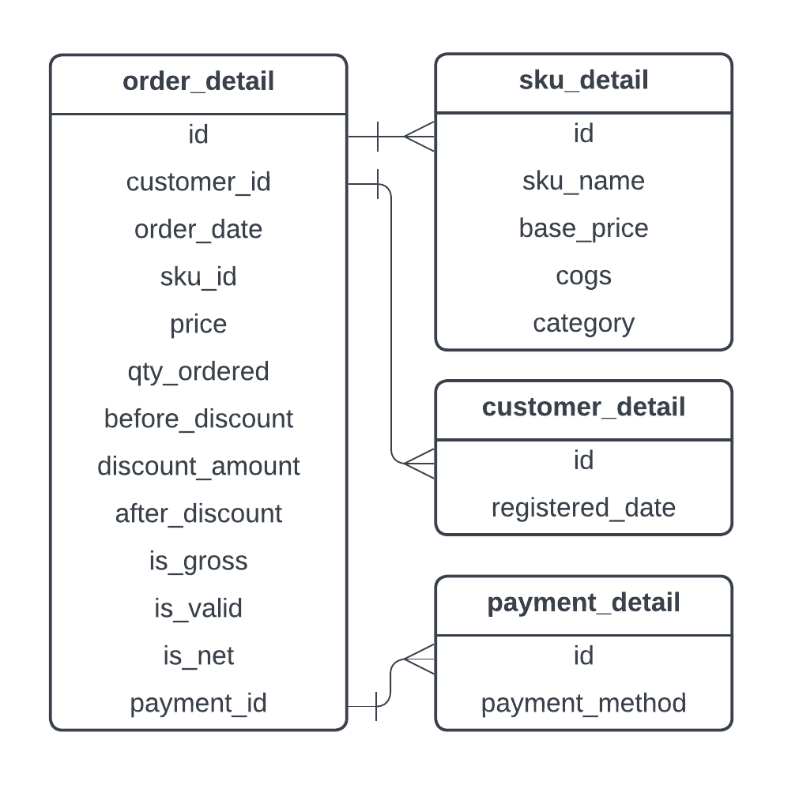

- `order_detail` is the central fact table containing individual transaction records.
- `sku_detail` provides product-level metadata, joined via `sku_id`.
- `payment_detail` contains information on how each order was paid, joined via `payment_id`.

Although the dataset also includes `customer_detail`, this project focuses only on `order_detail`, `sku_detail`, and `payment_detail`.

---

## Analysis

### 1. Total Revenue by Month (2021)

This query calculates the total revenue per month during the year 2021, based on valid transactions after discounts have been applied.

```sql
SELECT
  TO_CHAR(order_date, 'Month') AS month_2021, 
  ROUND(SUM(after_discount)) AS total_revenue
FROM
  order_detail
WHERE
  is_valid = 1 AND
  order_date BETWEEN '2021-01-01' AND '2021-12-31'
GROUP BY
  1
ORDER BY
  2 DESC;
   ```

Output: 
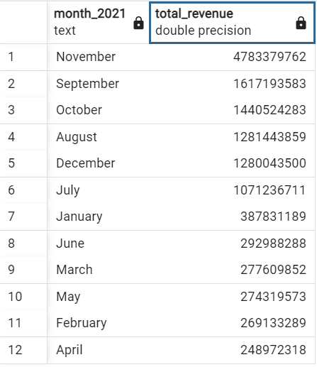

---

### 2. Total Customers, Orders, and Quantity by Month (2021)

This query provides a monthly breakdown of customer activity during 2021, including:

- The number of unique customers who placed valid orders
- The total number of orders
- The total quantity of items purchased

This analysis helps evaluate customer engagement and purchasing trends over time.

```sql
SELECT
  DATE_TRUNC('month', order_date) AS month,
  COUNT(DISTINCT customer_id) AS total_customers,
  COUNT(DISTINCT order_id) AS total_orders,
  SUM(sku_quantity) AS total_quantity
FROM
  order_detail
WHERE
  is_valid = 1
  AND order_date BETWEEN '2021-01-01' AND '2021-12-31'
GROUP BY
  1
ORDER BY
  1;
```

Output:
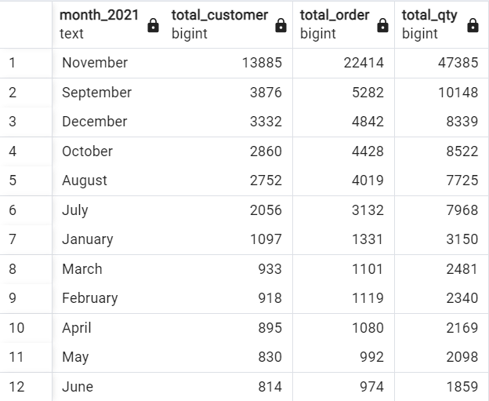

---

### 3. Top 5 Product Categories by Revenue in 2022

This query identifies the top 5 highest-grossing product categories throughout 2022.  
It joins `order_detail` and `sku_detail` to aggregate revenue by category based on valid orders.

```sql
SELECT
   sd.category,
   ROUND(SUM(od.after_discount)) AS total_revenue
FROM order_detail od
LEFT JOIN sku_detail sd 
  ON sd.id = od.sku_id
WHERE
   is_valid = 1 AND 
   order_date BETWEEN '2022-01-01' AND '2022-12-31'
GROUP BY 1
ORDER BY 2 DESC
LIMIT 5;
```
Output:
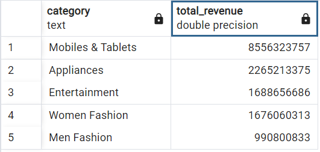

---

### 4. Revenue Comparison by Product Category (2021 vs 2022)

This query compares total revenue per product category between 2021 and 2022, and calculates the absolute revenue growth for each category.  
This helps identify which product categories grew or declined year-over-year.

```sql
SELECT
    category,
    SUM(CASE
        WHEN EXTRACT(YEAR FROM order_date) = 2021 THEN ROUND(after_discount)
        ELSE 0
    END) AS revenue_2021,
    SUM(CASE
        WHEN EXTRACT(YEAR FROM order_date) = 2022 THEN ROUND(after_discount)
        ELSE 0
    END) AS revenue_2022,
    SUM(CASE
        WHEN EXTRACT(YEAR FROM order_date) = 2022 THEN ROUND(after_discount)
        ELSE 0
    END) - SUM(CASE
        WHEN EXTRACT(YEAR FROM order_date) = 2021 THEN ROUND(after_discount)
        ELSE 0
    END) AS revenue_growth
FROM order_detail
LEFT JOIN sku_detail ON order_detail.sku_id = sku_detail.id
WHERE EXTRACT(YEAR FROM order_date) IN (2021, 2022)
  AND is_valid = 1
GROUP BY 1
ORDER BY 4 ASC;
```
Output:
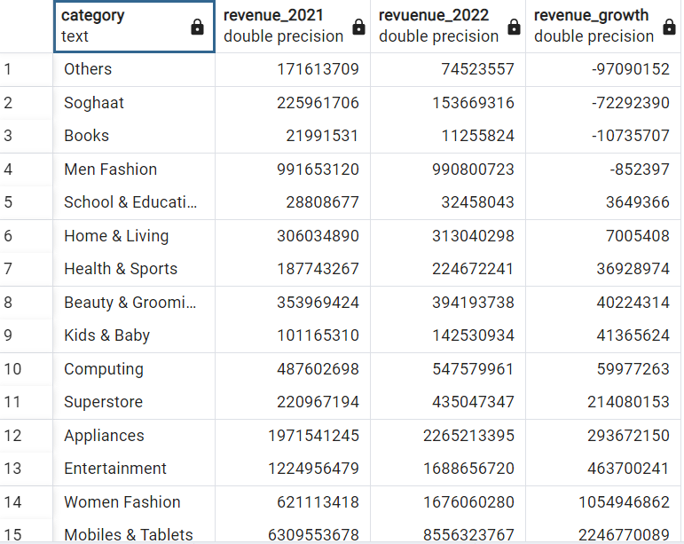

---

### 5. Top 10 SKUs by Revenue in 2022

This query lists the top 10 individual products (SKUs) that generated the highest revenue in 2022.  
In addition to total revenue, it also includes:

- The category each product belongs to
- The number of distinct customers
- The number of valid orders
- The total quantity sold

This analysis helps identify the best-performing products that contributed the most to overall sales.

```sql
SELECT 
     sku.sku_name,
     sku.category,
     ROUND(SUM(after_discount)) AS total_sales,
     COUNT(DISTINCT customer_id) AS customer,
     COUNT(DISTINCT ord.id) AS total_order,
     SUM(qty_ordered) AS total_qty
FROM order_detail ord
LEFT JOIN sku_detail sku
  ON ord.sku_id = sku.id
WHERE 
     is_valid = 1 AND 
     DATE_PART('YEAR', order_date) = 2022
GROUP BY 1, 2
ORDER BY ROUND(SUM(after_discount)) DESC
LIMIT 10;
```
Output:
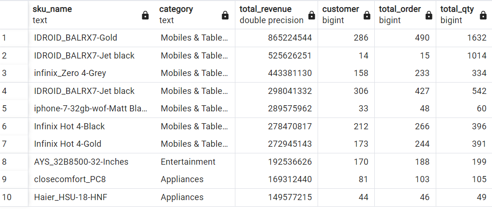

---

### 6. Top 5 Payment Methods in 2022

This query identifies the five most frequently used payment methods in 2022, based on the number of valid orders.  
It joins `order_detail` with `payment_detail` using `payment_id` to count how many orders were made with each method.

```sql
SELECT  
   py.payment_method,
   COUNT(DISTINCT ord.id) AS total_order
FROM order_detail ord
LEFT JOIN payment_detail py
  ON ord.payment_id = py.id
WHERE 
  EXTRACT(YEAR FROM order_date) = 2022
  AND is_valid = 1
GROUP BY 1
ORDER BY total_order DESC
LIMIT 5;
```
Output:
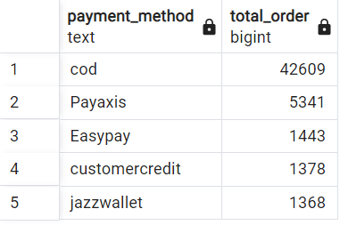

---

### 7. Top 5 Brands by Revenue

This query identifies the top 5 product brands based on total revenue.  
Since brand information is not explicitly stored in the dataset, a temporary brand mapping is created using `sku_name` patterns.

```sql
WITH tab_brand AS (
  SELECT
    id,
    (CASE 
       WHEN LOWER(sku_name) LIKE '%samsung%' THEN 'Samsung'
       WHEN LOWER(sku_name) LIKE '%apple%' OR LOWER(sku_name) LIKE '%iphone%' THEN 'Apple'
       WHEN LOWER(sku_name) LIKE '%sony%' THEN 'Sony'
       WHEN LOWER(sku_name) LIKE '%huawei%' THEN 'Huawei'
       WHEN LOWER(sku_name) LIKE '%lenovo%' THEN 'Lenovo'
    END) AS brand
  FROM 
    sku_detail
)
SELECT 
  sku.brand,
  ROUND(SUM(ord.after_discount)) AS total_revenue
FROM
  order_detail AS ord
LEFT JOIN
  tab_brand AS sku
  ON ord.sku_id = sku.id
WHERE
  is_valid = 1 AND
  brand IS NOT NULL
GROUP BY
  sku.brand
ORDER BY
  total_revenue DESC;
```
Output:
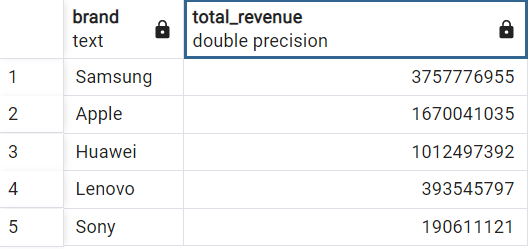

---

### 8. Profit Growth Comparison by Category (2021 vs 2022)

This query compares the profit generated by each product category in 2021 and 2022, and calculates the percentage growth.  
Profit is derived by subtracting cost of goods sold (`COGS`) from the discounted revenue.  
The calculation uses a CTE (common table expression) to first compute annual profit per category and then calculate year-over-year growth.

```sql
WITH profit AS (
  SELECT 
    EXTRACT('Year' FROM order_date) AS year_order,
    sku.category,
    SUM(ord.after_discount - (sku.cogs * ord.qty_ordered)) AS total_profit
  FROM
    order_detail AS ord
  LEFT JOIN
    sku_detail AS sku
    ON ord.sku_id = sku.id
  WHERE
    order_date BETWEEN '2021-01-01' AND '2022-12-31' AND
    is_valid = 1
  GROUP BY
    sku.category, year_order
),
year_profit AS (
  SELECT
    category,
    ROUND(SUM(CASE 
              WHEN year_order = 2021 THEN total_profit 
              ELSE NULL 
              END)) AS year_2021,
    ROUND(SUM(CASE 
              WHEN year_order = 2022 THEN total_profit 
              ELSE NULL 
              END)) AS year_2022
  FROM
    profit
  GROUP BY
    category
)
SELECT
  *,
  ROUND(((year_2022 / year_2021) - 1) * 100) AS growth_profit
FROM 
  year_profit
ORDER BY
  growth_profit DESC;
```
Output:
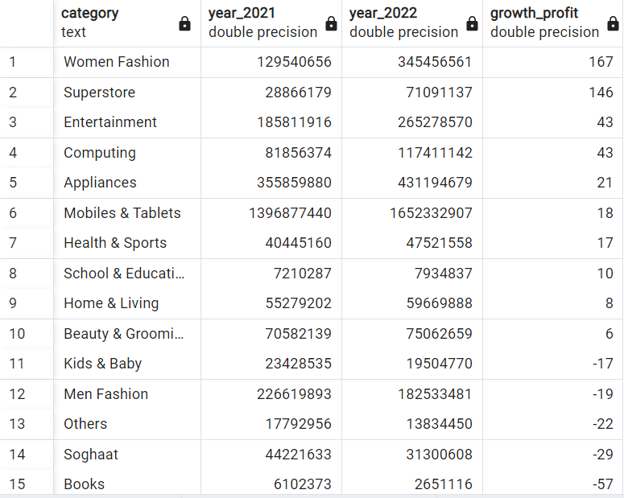

---

### 9. Top 5 Most Profitable SKUs in 2022 (Women Fashion Category)

This query identifies the five products (SKUs) within the *Women Fashion* category that contributed the highest profit in 2022.  
Profit is calculated as the difference between `after_discount` and the product of `COGS` and quantity ordered.

```sql
WITH profit AS (
  SELECT
    ord.id,
    sku.sku_name,
    ord.after_discount - (sku.cogs * ord.qty_ordered) AS profit
  FROM 
    order_detail AS ord
  LEFT JOIN 
    sku_detail AS sku 
    ON sku.id = ord.sku_id
  WHERE
    is_valid = 1 AND
    order_date BETWEEN '2022-01-01' AND '2022-12-31' AND
    sku.category = 'Women Fashion'
)
SELECT 
  sku_name,
  SUM(profit) AS total_profit
FROM 
  profit
GROUP BY 
  sku_name
ORDER BY 
  total_profit DESC
LIMIT 5;
```
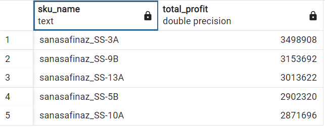

---

### 10. Top 5 Payment Methods by Product Category in 2022

This query analyzes the number of unique valid orders made using the five most common payment methods across each product category in 2022.  
It helps reveal how payment preferences vary by product type.

```sql
SELECT
  sku.category,
  COUNT(DISTINCT CASE WHEN pay.payment_method = 'cod' THEN ord.id END) AS cod,
  COUNT(DISTINCT CASE WHEN pay.payment_method = 'Easypay' THEN ord.id END) AS easypay,
  COUNT(DISTINCT CASE WHEN pay.payment_method = 'Payaxis' THEN ord.id END) AS payaxis,
  COUNT(DISTINCT CASE WHEN pay.payment_method = 'customercredit' THEN ord.id END) AS customercredit,
  COUNT(DISTINCT CASE WHEN pay.payment_method = 'jazzwallet' THEN ord.id END) AS jazzwallet
FROM 
  order_detail AS ord
LEFT JOIN 
  payment_detail pay 
  ON pay.id = ord.payment_id
LEFT JOIN 
  sku_detail sku 
  ON sku.id = ord.sku_id
WHERE 
  is_valid = 1 AND
  order_date BETWEEN '2022-01-01' AND '2022-12-31'
GROUP BY 
  sku.category
ORDER BY 
  cod DESC
LIMIT 5;
```
Output:
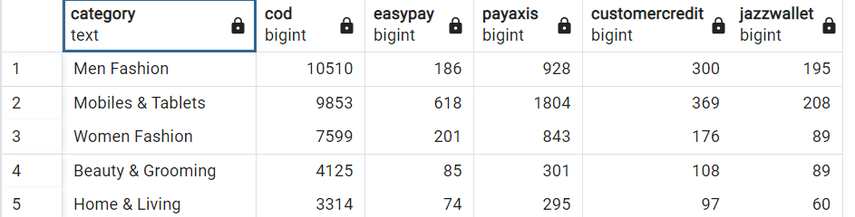

---

## Conclusion

This project demonstrates how SQL can be effectively used to extract actionable insights from raw e-commerce transaction data. By analyzing key metrics such as revenue trends, customer activity, product performance, profit margins, and payment behavior, we can better understand business performance across multiple dimensions.

Key takeaways from the analysis include:

- Seasonal revenue fluctuations with peak months identified  
- Categories and SKUs that significantly drive revenue and profit  
- Shifts in customer and payment behavior over time  
- The ability to quantify performance growth using year-over-year comparisons

These insights can support decision-making in areas such as marketing, inventory planning, pricing strategy, and payment optimization. Furthermore, this project highlights the importance of structured data and clean query logic in turning complex datasets into strategic knowledge.


